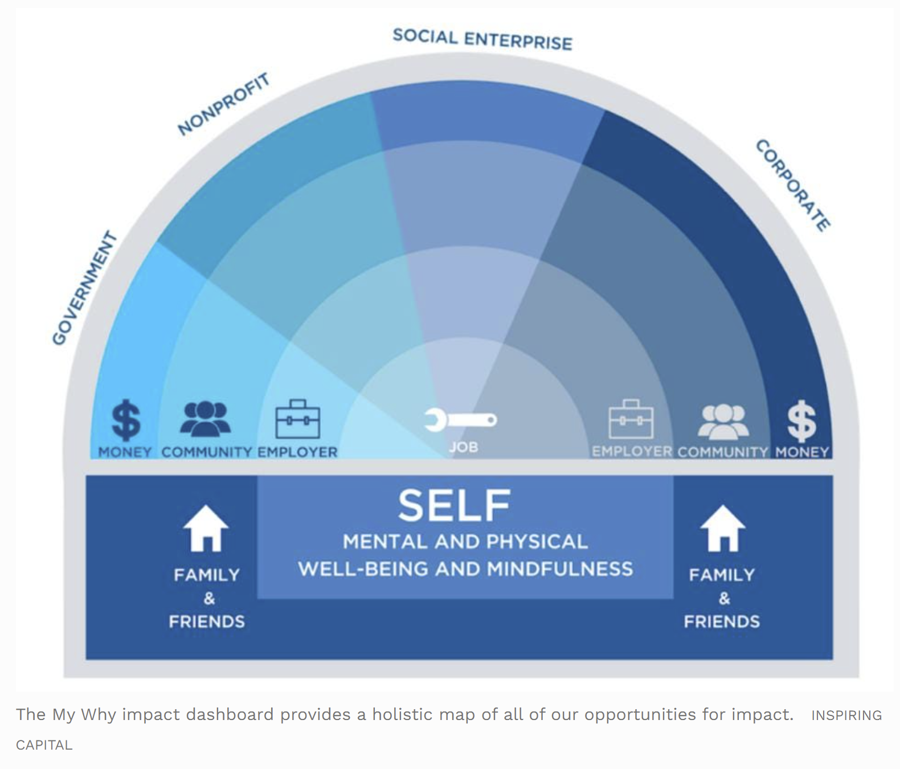

# Log

## 9/16/21 Thursday
### CAT Coffee EJ Chat
- This was a bit of an experiment, to see if we could talk about EJ & tech informally
- I think the answer is: No, we're not familiar enough with the intersection of tech & EJ. But we did have a nice conversation about a just transition ('Green New Deal' vs 'Green Industrial Revolution'), gold mining in Kenya, Climate Week events, and otters.

### WoCl x CAT EJ event planning
- Discussion about paying speakers & when it's appropriate & why it's important. Mainly, because it's work! And unless they're recruiting or selling something, they're not getting much value out of speaking. Also, the pool of people who can make time to speak will be limited. 
   - https://andybudd.com/archives/2013/08/paying_speakers_is_better_for_everybody
   - https://www.ppchero.com/you-speak-we-pay/
- Why do tech workers expect such high salaries but don't want to pay others (e.g., they never want to pay for software!)
- Shared ethical role models in tech
   - Samasource - now Sama. Book: Give Work. Leila Janah. Outsourcing fairly, pay is 3x
   - Dale Vince - Manifesto book. Fight about charging stations. We make money for the mission -- the mission isn’t to make money
https://www.eventbrite.co.uk/e/sustainability-book-club-20-manifesto-by-dale-vince-tickets-152316598045?aff=ebdsoporgprofile
   - Andela - engineering talent in Africa
   - Blocpower - listen to podcast - Donnel Baird

### Student organizing
- Welcome event is tonight. The new students are interested! I wish we had a task for them, or some way to keep in touch. The majority prefers Whatsapp, but it's hard to imagine having nuanced conversations about social justice on Whatsapp.
- Maybe we could try that social annotation tool and mark up the DEI report.

## 9/15/21 Wednesday
- CreativeCommons Conference!! https://summit.creativecommons.org/2021-program/
- AnitaB Open Source Day: https://ab-org.github.io/open-source-day/upcoming/
- Current thoughts on climate justice & action: 
   - If you can't see the complete problem, then how will you know if your action is the right action?
   - We like to talk about solutions in tech. We know how to come up with solutions! And the term 'community design' triggers the question, "How can the community come up with solutions if they don't know the tools/tech?" (like that Ford quote about people wanting a faster horse vs a car) 
   - BUT! If we think about _identifying the problem_ **first**, then it is easier to understand (& accept). For example, at the hackathon, they repeatedly told us to identify the right problem by listening to people. It's hard to remember (because it's more fun to build), but there isn't any resistence to the idea. 
   - So we can just translate that same process & mindset to climate "solutions".
   - I guess the main obstacle is that the climate problem we want to solve isn't always the problem that the community needs solved. So we need to start asking, "How can we solve two problems at once?" Which is exactly like corporate sustainability. "How can we help the business & the planet?" And climate justice is, "How can we help people & the planet?" 

### Tab closing
I am not allowed to open any more tabs or google anything else until I have a specific question that I want to answer. Plus I have to watch school lectures & pick a class. I will have plenty of media/info to consume.

- Core beliefs & the backfire effect, [The Oatmeal](https://theoatmeal.com/comics/believe). Feel, listen, change.
- Look into [Ruth Wilson Gilmore](https://en.wikipedia.org/wiki/Ruth_Wilson_Gilmore), Earth & Enviro sci at NYU with background in geography, incarceration, race. #to_read
- Mini-debate:[NIMBYism](https://www.bloomberg.com/opinion/articles/2021-09-12/the-left-s-nimby-war-against-renewable-energy) or [community self-determination](https://www.bloomberg.com/opinion/articles/2021-09-12/the-left-s-nimby-war-against-renewable-energy) against renewables? It's probably a little bit of both, but if the real problem is that we need renewables now, then why isn't the focus on compromise (or relocating the solar project & improving the siting process)? [The community's statement](http://www.saveourmesa.org/). [Maps](http://www.basinandrangewatch.org/Battle-Born-Solar.html).
- [Spheres of Impact](https://www.forbes.com/sites/nelldebevoise/2020/02/06/how-to-make-the-world-a-better-place-without-quitting-your-job-your-spheres-of-impact/?sh=47f48ef475fa)
-  

### What does working with a community fairly look like? #to_read
- "Equity-Centered Community Design" (ECCD): https://www.creativereactionlab.com/webinar-series 
- Origins of community design: https://www.plannersnetwork.org/2006/01/origins-of-community-design/
- Co-Design & open data!? https://communities.sunlightfoundation.com/action/codesign/  

## 9/14/21 Tuesday
### Health/Soil/Water Class 
Note: I actually like this professor so far. He seems to genuinely care about students and wants to help them learn.

- Prof recommended ArcGIS (licensed) and QGIS (open source). Doesn't talk about the differences, just mentions that you can get an education license (a discount!) for ArcGIS & to ask the TA about it. Discount > free. I can feel it myself. As a one-time decision, I would rather have a coupon for an expensive donut than a free-anytime donut. But that shouldn't be what the decision is based on. It should be based on [features](https://gisgeography.com/qgis-arcgis-differences/), industry usage, and how easy it is to learn & switch.
- One of the lecture topics was on villages in Kenya where people mined & processed gold. Blood lead levels were 10x the threshold for lead poisoning, and the child mortality rate was 25% in 2010. There was an intervention that reduced lead dramatically, it was a combination of education + employing locals to bury the toxic substances. 
- Blood lead levels dropped but were still above the threshold a few years later, and the prof suggested that more education + support + time will bring levels to normal. He admitted that it was naive a few times. Again - I like this professor, and think he's smart, but he's not naive. It's a kind of blindness. Earlier in the lecture he pointed out the the region was very dry and the community was very poor. It's not the education. It's the money. It's the soil quality. It's the power of the gold buyers.
- About the blindness -- it's some combination of our values ("education, information & knowledge will triumph") and the _framing_ of the problem (which is tied to all sorts of bias/prejudice/racism). 

## 9/13/21 Monday
- Enviro Activism Class: The prof urged us all to introduce each other & connect. Everyone had impressive bios, they worked with the UN, governments, think tanks, museums... I mentioned ClimateAction.tech and the lone business person/VC in the class asked for more info. Then the prof wrote it on the board. Felt proud for successfully making CAT sound interesting (for once), but also guilty that tech got more attention than "real" projects. (Alternate version: CAT got noticed bc it is a community & example of collective action, sort of.) 

## 9/12/21 Sunday: Hackathon
- Didn't make it into the top 10. Totally understandable, the teams that made it were much more established. Also I sounded like I was about to cry in my pitch.
- Most of the judges were impact VCs. They asked good questions about impact, but I wish there had been more emphasis put on different types of business models/funding.

## 9/11/21 Saturday: Hackathon
- Did they just use Uber as a positive example?
- Still don't have a real business model for CARL
- CARL needs a community platform. I think StackExchange has better functionality & pricing. But Discourse is open source.
- The cafe staff was taking out the recycling/trash as we were leaving. They motion to just mix the soda cans with the regular trash.

## 9/10/21 Friday
### Social Impact Hackathon
- Did a 30-sec pitch. Getting less scary
- Why is Elon Musk on the slide like he's a role model for social impact?
- The organizers recommend software to the teams. How can OSS compete?
  - Notion is giving $1000 credit to teams. 
  - Miro edu license
  - Loom for video recording

### Random links
bc i need to close tabs bc i am going to be on zoom & don't want my laptop to be slow
  - https://aboutfeeds.com/why
  - https://interconnected.org/home/
  - https://mindhacks.com/book/ < why does this book keep popping up!?
  - https://interconnected.org/home/
  - https://interconnected.org/home/2020/09/24/unoffice_hours < I want to do this but i am behind on past mtg follow-ups
  - https://www.eventbrite.com/e/introducing-the-nyc-peoples-tech-assemblies-the-future-of-tech-policy-registration-167346358463
  - https://www.cityandstateny.com/opinion/2021/08/time-shine-sunlight-public-authorities/184699/
  - https://www.youtube.com/watch?v=EWY_t37zegY
  - https://responsibletech.work/

### Who's idea was this anyway? #open-source
- https://steveblank.com/2009/12/07/someone-stole-my-startup-idea-%e2%80%93-part-2-they-raised-money-with-my-slides/
- Even though I want CARL to be open & I want people to use it for free, I still feel ownership over the idea & don't want people to steal it. As if I've even finished even one piece of content. I guess I am defensive & attached to it because I've spent so much time on it and I know that anyone else with more focus & clarity could do a much better job & be done by now. 
- Super grateful that others are working on this with me.

### On sharing pubicly
- This log is way too confusing. It's only been a few days & it's impossible to find anything. Would I ever skim this? Doctorow says that he doesn't look at his log.
- Maybe I should use tags & limit the headers to a few categories. Like just projects that I am working on for jsinternet. 

## 9/9/21 Thursday
- Reading
  - https://doctorow.medium.com/the-memex-method-238c71f2fb46
  - https://branch.climateaction.tech/issues/issue-2/open-climate-now/

## 9/8/21 Wednesday
- Feeling overwhelmed & too dumb & physically unable to focus on anything to understand things like:
  - https://irtf.org/hrpc
  - https://datatracker.ietf.org/rg/hrpc/meetings/
  - https://envirodatagov.org/environmental-data-justice/
  - An Environmental Data Justice Syllabus 1.0 https://docs.google.com/document/d/1O7ytnzXWFkluiYE4Pulo_mCHs9jdNpPm8hw83aLU2pg/edit#
  - https://www.publicbooks.org/trump-syllabus-3-0/
  - https://medium.com/@chanda/decolonising-science-reading-list-339fb773d51f
  - https://nycstandswithstandingrock.wordpress.com/standingrocksyllabus/
      - oh thank god they have something on youtube: https://nycstandswithstandingrock.wordpress.com/2016/11/03/watch-standing-rock-syllabus-nyc-teach-in-on-youtube/
  - [CARE Principles](https://www.rd-alliance.org/sites/default/files/CARE%20Principles%20for%20Indigenous%20Data%20Governance_FINAL_Sept%2006%202019.pdf)
- Where should I even save this info? 
- Also Texas wtf: https://www.texastribune.org/2021/09/06/texas-special-legislative-session-five-things/
- At least this statue was removed: https://www.npr.org/2021/09/08/1035004639/virginia-ready-to-remove-massive-robert-e-lee-statue-following-a-year-of-lawsuit
- Someone else using Github for non-code: https://github.com/newmerator/recipes 
- Comic idea: "This is fine" dog except he's stressing and has a million tabs open and is saying, "How can I do anything if I don't even understand how combustion works"
   - hahaha https://twitter.com/llegaspacheco/status/1111783777372639232
- Having doubts about sharing this 
- Retweeted something for the first time in foreve
r
## 9/7/21 Tuesday

## 9/6/21 Monday: Labor Day
- Convo w/E re: how to harness NFT/crypto hype for climate action
- _Amusing Ourselves to Death_: Maybe it's not just the internet ruining discourse, maybe it started with TV. 
- Panicked about finding a 3rd teammate for CARL

## 9/5/21 Sunday

## 9/4/21 Saturday

## 9/3/21 Friday
### Done
1. Made progress on the scoping workshop structure. 
   - Reused slides from the GHG Accounting overview talk that only two people attended. I knew it wasn't a waste!
   - I want to use Miro but it was just much easier to sort things out in Slides. New tool overhead.
2. Really appreciated this article about the proliferation of crappy ed-tech: https://morningsidepost.com/articles/2021/4/5/primal-scream-dept-universities-including-columbia-suffer-from-too-many-inefficient-platforms
   - Tried to add & welcome the new SEA members to our school student engagement platform. Got stuck in a redirect. Finally guessed that it was due to our group's registration status. 
   - Preferred vs actual name bugs galore
3. First meeting with a potential CARL collaborator went well! Trying to think of speaking in 
4. Tried to post a video update with Instagram stories, didn't feel coherent enough
5. Posted fellow intro on GWF 

### Misc
- I have too many tabs and emails. Is this log just making things worse.
- IDEA: This disconnect & this idea of "lenses" reminds me of the NYT video about an eye disability: https://www.nytimes.com/video/opinion/100000007778961/strabismus-vision-disability-relationships.html 
   - "Sea of difference"

## 9/2/21 Thursday
- Seeing the flooding videos & rain stats was scary. So I ignored them, tried to find a Pema Chodron quote that would make sense, got distracted. Texted ppl instead. Everyone is safe.
- J read the SUMA DEI audit & is fired up to change things! 
- Got mad at a CAT member who dismissed security and moderation considerations as evaluation criteria for Slack alternatives bc they are probably the 'same across the board'. That is a REASON but where is the EVIDENCE. Wasted half an hour trying to write something constructive, gave up. 
- The weather was beautiful though

### WoCl/CAT EJ meeting
- Dates are set! S is contacting potential speakers to discuss Climate Justice x tech! 
- S & R are being very thoughtful, whereas I want to wing it and leave some flexibility in the agenda until we have a speaker (who can help us set the agenda). 
- I'm trying to remind myself that it's not about just doing an event, it's also about the collaborative process: (1) Learning to work in a flat structure, (2) learning about R & S & their backgrounds, (3) changing some of CAT & WoCl's processes (like offering an honorarium for the first time) 

### Tamer Hackathon Mixer
- Fitbit thought I was exercising, but I was just panicking before my intro.
- C, E & J were there! Pretty exciting to see them & hear about their projects.
- Gotta recruit some teammates! It's ok if there wasn't much interest. Just need to find 1 more person who 'gets' CARL.
- The meeting ran long & I had forgotten DJ had picked up pizza. Apologized profusely.

### Tried out Hypothes.is
- https://web.hypothes.is/
- C recommended
- I want to use this with SEA for commenting on the DEI report
- Will other people use it?
- Why does it keep crashing Chrome

### Distractions
- Who is better at guessing who's high? A teacher (the Cut), a cop (Buzzfeed) or an audience (Jimmy Kimmel)?
- Video games that Elon Musk recommends. I don't even like Elon Musk but Youtube has been recommending him!  Overwatch, Hearthstone, Deus X - original
- ADHD in Women: https://youtu.be/EMpt40zNK-w
- The Remarkable Woman Who (sorta) Invented Stuffed Animals: https://youtu.be/r3SR-fN4G48, Aug 31, 2021, vlogbrothers
> In which John discusses the extraordinary life of Margarete Steiff and the invention of stuffed animals. 
> I first learned about Margarete Steiff while researching the (genuinely astonishing) history of teddy bears; you can listen to my essay on them here: https://www.wnycstudios.org/podcasts/...
> History is both a story of individual people making choices, and a story of systems interacting, and stuffed animals are for me a way into glimpsing some of the complex interplays that create historical change.
- https://steiffusa.com/press-releases/the-fascinating-story-of-margarete-steiff-1847-1909/

## 9/1/21 Wednesday
### Getting started vs _feels_
1. I signed the MOU! _I still haven't sent the payment info bc am paranoid about sending banking info over the internet._
2. I edited my intro blog post! _Do I even know anything? Why can't I just pretend to at least sound intelligent?_
3. I installed git! I'm going to use try to use this as a note-taking thing! _Wow I don't remember git at all._
4. _I don't have time to take a headshot. I don't want to post on Instagram like I said I was going to do. Why am I so behind. I could use a snack. I am really lucky to be here._
5. Why does my github pages setup only have one page?
6. Let's just go with the old headshot. I can replace it later. 
7. Yay I have 3 projects! _Stop messing with this. Send the headshot. Get ready for bed._

### Github pages & other features
- https://pages.github.com/
- https://docs.github.com/en/pages
- make multiple pages: https://phuston.github.io/patrickandfrantonarethebestninjas/howto
- https://jekyllrb.com/docs/
- https://docs.github.com/en/issues/using-labels-and-milestones-to-track-work/about-milestones

### Random

How Bitcoin Became El Salvador's Currency, Motherboard - Vice
- https://youtu.be/aVVZXUFItZY
- Donor is unknown
- Prez wants to mine Bitcoin. Energy intensive
- "Create jobs to keep kids out of gangs"
- Michael Peterson, Bitcoin Beach founder... describes physical examples of poverty (live in a shack, dirt floors) and then defines success as 'zipping around payments'. 'Bitcoin is the money of the poor.' Free people from the financial institutions... people will finally have a voice.
   - Strike
   - Tries to stay behind the scenes
   - Empower the local talent
- Pros: 
   - Gain money when Bitcoin price increases
   - Digitization for bill payment. Saves the customer 2-3 hours of travel and waiting in lines. Does it have to be Bitcoin?
   - 
- Cons: 
   - Street vendor is having trouble with her account and can't accept payments.
   - Lost money when Bitcoin prices dropped.
   - There's only one ATM. People have to travel to go there. ATM runs out of money

 Eminem's box of notes
 - https://www.youtube.com/watch?v=pPXBwy3JgVo
